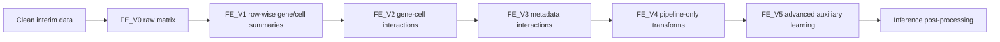
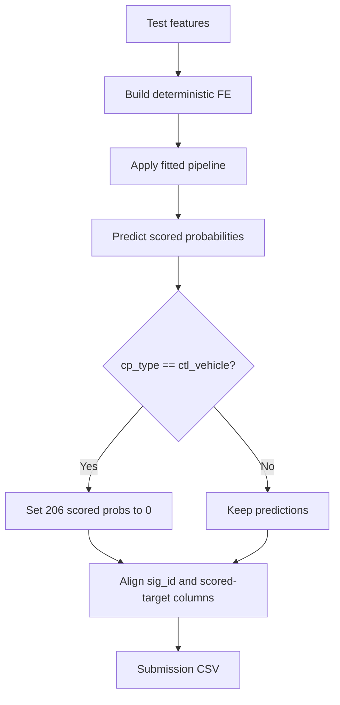
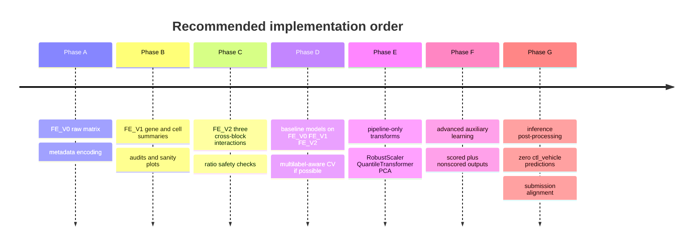

# MoA Feature Engineering Master Plan

## Executive summary

Your EDA is already strong enough to support a **clear, leakage-free, MoA-specific feature-engineering strategy**.

The local audit of your uploaded notebook and CSV artifacts shows four dominant constraints. First, the scored target matrix is **extremely sparse**: only **0.3434%** of scored target entries are positive, **39.3340%** of samples have zero active scored targets, and only **8.0415%** of samples have more than one active scored target. Second, label frequency is highly uneven: among the **206 scored targets**, **22** are very rare with **1–9** positives and **97** are rare with **10–49** positives. Third, repeated compounds are a real validation risk: in random 5-fold splits, the mean validation unique-drug overlap is about **98.9%**, and about **99.46%** of validation samples come from drugs already seen in the corresponding training fold. Fourth, control rows are structurally special: `ctl_vehicle` rows have zero scored-target activity and should be zeroed only **after prediction** at inference/submission time. *(Local EDA audit.)*

The correct engineering response is therefore **not** to build fancy target-derived features. The correct response is to build a **layered family of deterministic, row-wise, biologically plausible features** from the gene and cell blocks, keep all “learned” transformations inside the model pipeline, monitor the rare-label regime explicitly, and keep validation/inference rules separate from feature construction. This is aligned with standard leakage-avoidance guidance in scikit-learn, where transforms such as scaling, PCA, and feature selection must be fit on training folds only, ideally inside a `Pipeline`. citeturn20view0turn20view3

The strongest baseline plan from your EDA is:

- **Keep raw gene + cell + metadata features**.
- Add **row-wise gene summary features**.
- Add **row-wise cell summary features**.
- Add a **small, audited set of gene–cell interaction features**.
- Keep **drug_id, scored targets, nonscored targets, target counts, and any target-derived summaries out of X**.
- Treat **scaling, quantile transforms, PCA, variance filtering, threshold features, and feature selection as pipeline-only** steps.
- Run **baseline validation with multilabel-aware splitting if feasible**, and run **drug-aware GroupKFold only as a robustness experiment**, not as the only baseline.
- At inference, **force all scored predictions to zero for `ctl_vehicle` rows** and verify that submission columns match the scored target columns exactly. citeturn20view0turn20view1turn3academia2turn16academia0

**বাংলা সারাংশ:** baseline-e simple row-wise feature diye start korte hobe; scaler/PCA/threshold sob pipeline-er vitore fit korte hobe; target-derived kichu X-e jabe na; control-row zeroing hobe shudhu inference-e.

## What the uploaded EDA proves

The EDA gives a more specific story than a generic “high-dimensional biotech dataset” description.

### Audit snapshot from your notebook and CSV artefacts

| Area | Local audit finding | Why it matters |
|---|---|---|
| Scored targets | 206 scored labels; positive density 0.3434% | Extreme sparsity means metrics and splits can become unstable |
| Sample label structure | 39.3340% zero-label samples; 8.0415% multi-label (>1) | Keep zero-label rows; use multilabel framing, not multiclass |
| Rare-label regime | 22 targets with 1–9 positives; 97 with 10–49 positives | Rare-label monitoring is mandatory |
| Nonscored labels | 402 nonscored targets; density 0.0523%; 16.11% nonscored-only samples | Useful only as advanced auxiliary outputs, never as baseline inputs |
| Metadata | `cp_type`, `cp_time`, `cp_dose` matter; control rows are structurally zero | Metadata should stay; `cp_type` is especially important |
| Gene block | 772 features; meaningful variation, skewness, outliers | Summary features are justified |
| Cell block | 100 features; stronger variance and negative skewness | Summary features and robust preprocessing are justified |
| Cross-block signal | High gene / high cell group has strongest target activity | Small interaction feature set is justified |
| Train–test shift | Broadly aligned; max standardised shift ≈ 0.0702 for genes, 0.0463 for cells | Do not drop features from EDA alone |
| Repeated drugs | Random-fold overlap is extremely high | Random CV may be optimistic for unseen-drug generalisation |
| Fold coverage | 6–11 zero-positive targets per fold; >100 targets/fold with <10 positives | Aggregate fold score can hide rare-label failure |
| Control inference | Train control rows: 1,866/23,814; test control rows: 358/3,982 | Post-prediction zeroing rule is valid |

### The practical meaning of the audit

The **feature-engineering centre of gravity** in this project is **sample-wise summarisation plus carefully limited cross-block interactions**. Your EDA does **not** support aggressive manual dropping, target-derived enrichment, or indiscriminate thresholding. It supports a conservative progression:

1. raw metadata + raw gene/cell matrix,
2. deterministic row-wise biological summaries,
3. deterministic cross-block interactions,
4. optional pipeline-only transforms,
5. advanced auxiliary learning only after the baseline is stable.

This matches the broader literature on gene-expression ML, where high dimensionality, sparsity, and instability make preprocessing choices consequential; dimensionality reduction and feature extraction can help, but only when they are validated properly and not allowed to leak across folds. citeturn18academia0turn18academia7

**বাংলা সারাংশ:** EDA clearly boleche raw block + summary block + small interaction block best starting point; aggressive feature dropping ba target diye feature banaono bhalo na.

## Literature and documentation synthesis

Three external evidence themes matter most for your notebook design.

### Leakage control is not optional

The scikit-learn pitfalls guide is explicit: data leakage happens when information unavailable at prediction time is used during model building, and preprocessing should be learned from the training subset only. The documentation specifically names **StandardScaler**, **PCA**, and feature-selection steps as leakage-sensitive, and recommends `Pipeline` to make the training-fold-only fit/transform sequence safer and reproducible. citeturn20view0turn20view3

That external guidance maps directly to your EDA. Your row-wise summaries are safe because they are deterministic functions of a single sample’s inputs. But anything that estimates a distribution, a rank map, a variance threshold, principal directions, or a supervised selection rule is **pipeline-only**. That includes `StandardScaler`, `RobustScaler`, `QuantileTransformer`, `PCA`, `VarianceThreshold`, and any feature selector with access to `y`. citeturn20view0turn21view0turn21view1turn21view2turn22view0turn20view2

### Group-aware validation matters when compounds repeat

Your local audit found severe repeated-drug overlap in random folds. That concern is strongly supported by external work in L1000/CMap benchmarking: recent “Leak Proof CMap” work argues that unbiased evaluation should prevent similar treatments and shared-response patterns from leaking across train/validation/test, because leakage can otherwise inflate apparent model quality. scikit-learn’s `GroupKFold` exists precisely to enforce non-overlapping groups across folds. citeturn16academia0turn20view1

This does **not** mean drug-group validation must replace the baseline immediately. It means you should treat it as the **robustness benchmark for compound generalisation**, while keeping a multilabel-aware baseline split for model selection and ablation work.

### Multilabel stratification is justified for this target space

Your scored target space is sparse, imbalanced, and co-occurring. External multilabel stratification literature shows that iterative stratification helps preserve label and label-pair distributions better than ordinary k-fold, reducing fold instability and improving the reliability of evaluation under sparse multilabel regimes. citeturn3academia2turn3academia0

That is fully consistent with your fold-risk audit, where each random fold still contains several zero-positive targets and more than 100 labels with fewer than 10 positives. So your engineering notebook should be written **as if** downstream validation will be multilabel-aware, even if you still compare against ordinary k-fold for reference.

### High-dimensional gene-expression data benefits from disciplined preprocessing, not indiscriminate reduction

Gene-expression ML reviews consistently emphasise that high-dimensional expression spaces often require careful preprocessing, transformation, and dimension reduction; however, those choices are dataset- and model-dependent, and must be validated, not assumed. In scikit-learn, PCA centres features but does not scale them for you, which is important if you mix gene and cell blocks with different dispersion. `RobustScaler` uses median and IQR, which is particularly relevant when your EDA has already shown strong skewness and outliers in the cell block. `QuantileTransformer` is a learned empirical-quantile mapping, so it is powerful but strictly fold-fitted. citeturn18academia0turn18academia7turn21view1turn22view0turn20view2

**Important limitation:** I could not robustly verify enough Kaggle winner writeups from official/public MoA solution pages in this session to use them as hard evidence. So the final plan below is grounded primarily in **your audited EDA**, **official scikit-learn documentation**, and **relevant multilabel/CMap literature**—not in unverified folklore about “what winners used”.

## Decision matrix

The table below converts your EDA into actionable engineering decisions.

| EDA claim | External support or tension | Recommended action |
|---|---|---|
| Target matrix is extremely sparse and imbalanced | Multilabel stratification literature supports preserving label distributions across folds. citeturn3academia2turn3academia0 | Prefer multilabel-aware CV for main model selection; track rare labels separately |
| Rare labels disappear in random validation folds | Fold-risk audit confirms 6–11 zero-positive labels per fold; iterative stratification helps reduce this problem. citeturn3academia2 | Keep all 206 targets, but monitor rare-label metrics explicitly |
| Random folds heavily reuse drugs between train and validation | Leak-proof CMap benchmarking and GroupKFold docs both support group-aware separation when repeated treatments exist. citeturn16academia0turn20view1 | Do not trust random CV alone for compound generalisation; add drug-aware robustness CV |
| Gene and cell blocks are informative but stable across train/test | High-dimensional gene-expression work supports careful preprocessing/dimensionality reduction rather than unsupported dropping. citeturn18academia0turn18academia7 | Keep both blocks; do not drop shifted features from EDA alone |
| Gene and cell summarise different but related biology | No conflict with literature; this is a dataset-specific finding | Build separate gene summaries, separate cell summaries, then small cross-block interactions |
| Control rows have structural zero activity | No tension; this is a structural dataset rule from local audit | Keep `cp_type` as metadata, keep control rows in training, zero predictions only at inference |
| Nonscored labels are auxiliary and much sparser | Multitask ideas may help, but leakage rules still apply | Baseline: ignore nonscored labels. Advanced: use as auxiliary outputs only, never inputs |
| Cell features are skewed and outlier-heavy | `RobustScaler` and quantile transforms are designed exactly for learned distribution-based preprocessing. citeturn22view0turn20view2 | For linear/NN branches, test robust or quantile scaling inside CV only |
| PCA may help compress block structure | PCA is legitimate, but fit is leakage-sensitive and it does not scale automatically. citeturn21view1turn20view0 | PCA stays optional and pipeline-only, mainly for linear/NN variants |
| Any target-derived feature would leak | scikit-learn common-pitfalls guidance is explicit on leakage risk from preprocessing/selection using forbidden information. citeturn20view0 | Ban all target-derived columns from X |

**বাংলা সারাংশ:** decision matrix-er core message holo—safe row-wise feature age, learned transform pore, validation-er jonno multilabel-aware + drug-aware check rakho.

## Feature-engineering master plan

### Design principle

The master plan uses **feature-set versioning**. That is the safest way to stay scientific and mistake-free.



### What goes into each version

#### FE_V0 raw baseline

**Use**
- `cp_type`
- `cp_time`
- `cp_dose`
- all `g-*` features
- all `c-*` features

**Do not use**
- `drug_id`
- any scored target column
- any nonscored target column
- `active_target_count`
- `zero_label_flag`
- any target summary or co-occurrence statistic

**Implementation**
- Encode metadata deterministically.
- Recommended: one-hot encode `cp_time` and `cp_dose`; keep `cp_type` as a binary indicator or one-hot.

**Why**
This creates the leakage-free benchmark against which every later feature layer can be tested.

#### FE_V1 row-wise biological summaries

These are **safe before CV** because they are deterministic functions of a sample’s input row only.

| Feature | Formula | Why keep it | Where |
|---|---|---|---|
| `gene_mean` | mean of all gene columns | average transcriptomic direction | pre-CV feature engineering |
| `gene_std` | std of all gene columns | within-sample spread | pre-CV feature engineering |
| `gene_abs_mean` | mean(abs(gene)) | overall response magnitude | pre-CV feature engineering |
| `gene_min` | min(gene) | strongest negative response | pre-CV feature engineering |
| `gene_max` | max(gene) | strongest positive response | pre-CV feature engineering |
| `gene_range` | `gene_max - gene_min` | response width | pre-CV feature engineering |
| `cell_mean` | mean of all cell columns | average cell-state direction | pre-CV feature engineering |
| `cell_std` | std of all cell columns | within-sample variability | pre-CV feature engineering |
| `cell_abs_mean` | mean(abs(cell)) | overall cell-response magnitude | pre-CV feature engineering |
| `cell_min` | min(cell) | strongest negative cell response | pre-CV feature engineering |
| `cell_max` | max(cell) | strongest positive cell response | pre-CV feature engineering |
| `cell_range` | `cell_max - cell_min` | cell response width | pre-CV feature engineering |

**Checks for every summary feature**
- no `NaN`
- no `inf`
- train/test both contain the column
- distribution not degenerate
- control/treatment separation remains plausible
- no target columns used in computation

#### FE_V2 cross-block interactions

Keep this layer deliberately small. Your EDA supports **interaction existence**, but not a huge combinatorial explosion.

| Feature | Formula | Why keep it | Risk control |
|---|---|---|---|
| `gene_minus_cell_abs_mean` | `gene_abs_mean - cell_abs_mean` | difference in gene vs cell response strength | deterministic, safe |
| `gene_to_cell_abs_mean_ratio` | `gene_abs_mean / (cell_abs_mean + eps)` | relative genomic vs cell-strength signal | must use epsilon; check `inf` |
| `gene_cell_abs_mean_product` | `gene_abs_mean * cell_abs_mean` | strongest EDA-supported joint high-response feature | deterministic, safe |

**Recommended**
- `eps = 1e-6`
- after ratio creation: replace inf with NaN, then assert none remain
- store a simple distribution audit for each interaction

**Do not do yet**
- hundreds of polynomial interactions
- pairwise gene×gene or cell×cell expansions
- target-conditioned interactions
- threshold-based “high response” labels created from full data

#### FE_V3 small metadata interactions

This layer is optional but reasonable because your EDA retained metadata relevance.

**Recommended candidates**
- `cp_time_24_x_cp_dose_D1`-style one-hot interactions, or a full interaction block produced from encoded metadata
- `cp_type × cp_time`
- `cp_type × cp_dose`

**Why**
The EDA did not find huge metadata main effects on average target count, but these are part of the experimental design and can still interact with biological summaries.

**Guardrail**
Do not let metadata interaction generation explode into thousands of sparse columns unnecessarily.

#### FE_V4 pipeline-only transforms

This version is **not** a saved pre-CV feature table. It is a modeling-pipeline branch applied on top of FE_V0/V1/V2/V3.

| Transform | Use case | Rule |
|---|---|---|
| `StandardScaler` | linear / NN branch when you want zero-mean, unit-variance features | fit on train fold only citeturn21view0turn20view0 |
| `RobustScaler` | linear / NN branch if outliers/skew dominate, especially in cell summaries | fit on train fold only citeturn22view0turn20view0 |
| `QuantileTransformer(output_distribution="normal")` | advanced linear / NN branch if you want a rank-Gauss-like mapping | fit on train fold only citeturn20view2turn20view0 |
| `PCA` on gene block | optional compression of 772-gene block | scale/transform first if needed; fit on train fold only citeturn21view1turn20view0 |
| `PCA` on cell block | optional compression of 100-cell block | fit on train fold only citeturn21view1turn20view0 |
| `Combined PCA` | optional on concatenated gene+cell numeric matrix | only after careful scaling choice |
| `VarianceThreshold` | optional compute-saving unsupervised filter | fit on train fold only; not needed for baseline citeturn21view2turn20view0 |

**Strong recommendation**
Do **not** do PCA in `03_feature_engineering.ipynb` globally and save the transformed matrix as the canonical dataset. Save only the deterministic feature tables; do learned transforms inside the training notebook or in fold-aware helper code.

#### FE_V5 advanced auxiliary learning

This is explicitly **advanced**, not baseline.

**Allowed**
- joint model output: `206 scored + 402 nonscored`
- evaluate validation performance on scored targets only
- compare against scored-only baseline

**Forbidden**
- putting nonscored labels into X
- deriving input features from nonscored targets
- using nonscored information at inference for the public submission output

### Safe fitting pseudocode

```python
# Safe, deterministic feature engineering done once
X_train_fe = build_rowwise_features(train_features_clean)
X_test_fe  = build_rowwise_features(test_features_clean)

# Forbidden-column audit
forbidden = set(scored_target_features) | set(nonscored_target_features) | {
    "active_target_count", "zero_label_flag", "multi_label_count", "drug_id"
}
assert not forbidden.intersection(X_train_fe.columns)

# CV-safe modeling pipeline
pipe = Pipeline([
    ("scale", RobustScaler()),   # or QuantileTransformer / StandardScaler / passthrough
    ("pca", PCA(n_components=K)),  # optional
    ("model", estimator)
])

# inside each fold
pipe.fit(X_train_fold, y_train_fold)
pred_valid = pipe.predict_proba(X_valid_fold)
```

### Model-wise usage guidance

| Model family | Best starting feature version | Preprocessing | Notes |
|---|---|---|---|
| Tree ensembles | FE_V0 or FE_V1, then FE_V2 | usually no scaling | Good benchmark; summaries/interactions may help; PCA usually unnecessary |
| Linear one-vs-rest | FE_V1 or FE_V2 | scaling mandatory; PCA optional | Strong interpretable baseline; more sensitive to skew/scale |
| MLP / tabular NN | FE_V1 or FE_V2 | scaling or quantile transform strongly recommended | Best place to test PCA and auxiliary outputs |
| Multi-task NN | FE_V2 | scaling/quantile optional; auxiliary head allowed | Advanced only; evaluate scored targets only |

**Recommended first sequence**
- Start with **linear + FE_V1**
- then **NN + FE_V1**
- then **NN + FE_V2**
- only then test **PCA/Quantile branches**
- only after that test **auxiliary nonscored output heads**

**বাংলা সারাংশ:** FE_V0 raw, FE_V1 summary, FE_V2 interaction—ei তিনটা must. PCA/Quantile/auxiliary holo পরে, pipeline-only, baseline na.

## Leakage guardrails and automated checks

### Hard leakage rules

| Category | Rule |
|---|---|
| Target leakage | No scored target, nonscored target, target count, target summary, or target co-occurrence feature may enter X |
| Split leakage | Never fit scaler, quantile transform, PCA, variance filter, or supervised selector before fold split |
| Fold leakage | Fold-level label frequencies or rare-label statistics are diagnostics only, never input features |
| Drug leakage | `drug_id` is for diagnostics or group CV only, not baseline input |
| Inference rule | `ctl_vehicle` predictions are zeroed after model prediction, not by changing training labels |
| Submission safety | Final columns must be exactly `sig_id + 206 scored targets`, in sample-submission order |

### Automated assertions for `03_feature_engineering.ipynb`

Use these as actual notebook assertions, not just prose.

```python
# Shape and identity
assert train_fe.shape[0] == train_features_clean.shape[0]
assert test_fe.shape[0] == test_features_clean.shape[0]
assert train_features_clean["sig_id"].is_unique
assert test_features_clean["sig_id"].is_unique

# Column match
assert list(train_fe.columns) == list(test_fe.columns)

# No forbidden features
forbidden_cols = set(scored_target_features) | set(nonscored_target_features) | {
    "drug_id", "active_target_count", "zero_label_flag", "multi_label_count"
}
assert not forbidden_cols.intersection(train_fe.columns)

# Numeric sanity
num_cols = train_fe.select_dtypes(include=["number"]).columns
assert np.isfinite(train_fe[num_cols].to_numpy()).all()
assert np.isfinite(test_fe[num_cols].to_numpy()).all()

# Ratio safety
ratio_cols = [c for c in train_fe.columns if "ratio" in c]
assert not train_fe[ratio_cols].isna().any().any()
assert not test_fe[ratio_cols].isna().any().any()

# Submission compatibility
assert len(scored_target_features) == 206
assert sample_submission.shape[0] == test_fe.shape[0]
assert sample_submission.columns[1:].tolist() == scored_target_features
```

### Sanity plots worth keeping

Use one or two lightweight plots only:
- train vs test KDE/hist for `gene_abs_mean`, `cell_abs_mean`, `gene_cell_abs_mean_product`
- boxplot of engineered summaries by `cp_type`

Those plots are for sanity, not for decision-making by themselves.

### Inference flow



## Notebook blueprint and prioritised action list

### Exact `03_feature_engineering.ipynb` structure

#### Scope and rules
- markdown: dataset scope
- markdown: leakage rules
- code: import libraries and define paths

#### Load clean interim data
- code: load train/test clean features
- code: load scored/nonscored targets
- code: load feature groups
- code: verify `sig_id`, column order, row counts

#### Build FE_V0
- code: one-hot or deterministic metadata encoding
- code: concatenate metadata + raw gene + raw cell
- code: save `fe_v0_train.parquet`, `fe_v0_test.parquet`

#### Build FE_V1
- code: gene summaries
- code: cell summaries
- code: feature audit table
- code: save `fe_v1_train.parquet`, `fe_v1_test.parquet`

#### Build FE_V2
- code: cross-block interactions
- code: epsilon/NaN/inf checks
- code: save `fe_v2_train.parquet`, `fe_v2_test.parquet`

#### Build FE_V3
- code: optional metadata interactions
- code: save `fe_v3_train.parquet`, `fe_v3_test.parquet`

#### Alignment and leakage audit
- code: forbidden-column audit
- code: train/test column match audit
- code: numeric sanity audit
- code: save audit CSVs

#### Handoff notes
- markdown: pipeline-only transforms list
- markdown: model-wise usage notes
- markdown: inference/post-processing note

### Recommended save names

```text
outputs/processed/
    fe_v0_train.parquet
    fe_v0_test.parquet
    fe_v1_train.parquet
    fe_v1_test.parquet
    fe_v2_train.parquet
    fe_v2_test.parquet
    fe_v3_train.parquet
    fe_v3_test.parquet

outputs/experiment_logs/
    fe_feature_manifest.csv
    fe_forbidden_column_audit.csv
    fe_train_test_alignment_audit.csv
    fe_numeric_sanity_audit.csv
    fe_ratio_safety_audit.csv
    fe_version_summary.csv

reports/figures/
    fe_train_test_summary_feature_check_gene_abs_mean.png
    fe_train_test_summary_feature_check_cell_abs_mean.png
```

### Example feature-manifest schema

| version | feature_count | includes_raw | includes_summaries | includes_interactions | learned_transforms_included |
|---|---:|---|---|---|---|
| FE_V0 | baseline count | yes | no | no | no |
| FE_V1 | FE_V0 + 12 | yes | yes | no | no |
| FE_V2 | FE_V1 + 3 | yes | yes | yes | no |
| FE_V3 | FE_V2 + metadata interaction count | yes | yes | yes | no |

### Prioritised action list



The **highest-priority practical sequence** is:

1. **Implement FE_V0–FE_V2 only.**
2. Train baseline models and compare V0 vs V1 vs V2.
3. Only if V2 stabilises, test pipeline-only transforms.
4. Only if the scored-only baseline is strong, test auxiliary nonscored outputs.

**বাংলা সারাংশ:** protome step holo FE_V0 → FE_V1 → FE_V2 implement kora, tarpor model compare kora. PCA/Quantile/auxiliary age na.

## Open questions and limitations

Some details remain intentionally conservative.

I could not verify enough Kaggle MoA winner writeups from primary public pages in-session to make hard claims such as “all top solutions used RankGauss” or “winner solutions always used auxiliary nonscored heads”. Because of that, this report does **not** depend on those unverified claims. The plan instead rests on your local EDA, official scikit-learn documentation, and relevant multilabel/CMap literature. citeturn20view0turn20view3turn20view1turn3academia2turn16academia0

A second limitation is that the uploaded artefacts provide decision tables and summaries, but not the full interim feature matrices, so I did not recompute fresh correlations or alternative summary statistics from raw data in this report. I therefore stayed close to the EDA-supported feature family instead of proposing a much wider speculative feature library.

A third limitation is that pathway-level or gene-set-level aggregation was not specified in the uploaded artefacts. If a later notebook introduces curated pathway annotations, those could become a meaningful **advanced** feature family—but they should not delay the current deterministic FE_V0–FE_V2 implementation.

The safest final conclusion is simple:

**Build the first production-quality feature-engineering notebook around deterministic row-wise summaries plus three audited cross-block interactions, keep all learned transforms inside validation-safe pipelines, never let target-side information enter X, and treat drug-aware validation and auxiliary learning as later robustness layers rather than baseline requirements.**